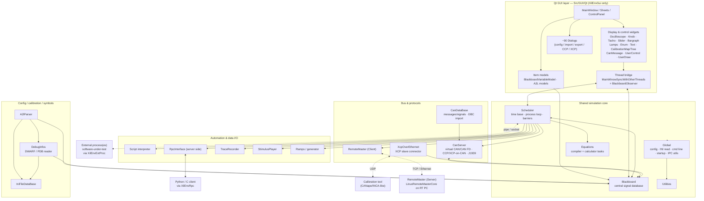
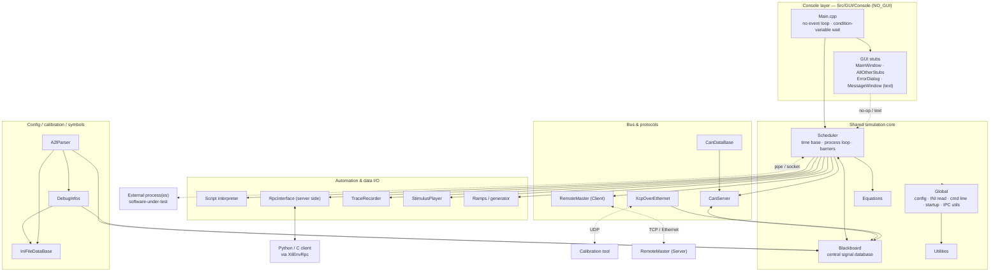

# OpenXilEnv Architecture

This document gives an architectural overview of the two OpenXilEnv executables
&mdash; **XilEnvGui** (graphical) and **XilEnv** (command line) &mdash; and of the
software components that make up the repository. It is intended as an entry
point for developers who want to understand how the many modules under
[`Src/`](../Src) fit together.

For the end-user view of the SiL/HiL system, see the [Readme](../Readme.md).

## Table of contents

- [Big picture](#big-picture)
- [Build outputs](#build-outputs)
- [Component diagram: XilEnvGui](#component-diagram-xilenvgui)
- [Component diagram: XilEnv (CLI)](#component-diagram-xilenv-cli)
- [The two tools compared](#the-two-tools-compared)
- [Shared simulation core](#shared-simulation-core)
- [Configuration, calibration and symbols](#configuration-calibration-and-symbols)
- [Bus, protocol and remote components](#bus-protocol-and-remote-components)
- [Automation and data I/O](#automation-and-data-io)
- [The external process interface](#the-external-process-interface)
- [Other components in the repository](#other-components-in-the-repository)

## Big picture

OpenXilEnv is a **S**oftware/**H**ardware **I**n **t**he **L**oop environment.
Its job is to run a piece of embedded software (or a model) in a deterministic,
time-simulated environment, to feed it stimulus, to observe and calibrate its
variables, and to simulate the buses (CAN / CAN FD) it talks to.

Architecturally the product is built around one central idea: a **Blackboard**
(an in-memory signal database) sits at the centre, and a **Scheduler** advances
simulated time in fixed cycles, running a set of *processes* against that
Blackboard every cycle. Processes are either:

- **internal** &mdash; compiled into the executable (CAN server, script
  interpreter, recorder, player, ramp generator, equation calculator, RPC
  control, &hellip;), or
- **external** &mdash; the software-under-test, running in its **own** OS
  process for memory protection and communicating with XilEnv over an IPC
  channel (named pipe / Unix domain socket / TCP socket).

Both executables are compiled from the **same** set of internal libraries under
`Src/`. The only substantial difference is the user-interface layer:
`XilEnvGui` links the Qt GUI (`Src/GUI/Qt`), while `XilEnv` links a set of
headless console stubs (`Src/GUI/Console`) and is compiled with `NO_GUI`.

## Build outputs

The top-level [`CMakeLists.txt`](../CMakeLists.txt) produces the following
artifacts (64-bit host unless noted):

| Artifact | Type | Purpose |
| --- | --- | --- |
| **XilEnvGui** | executable | Qt-based graphical SiL/HiL environment |
| **XilEnv** | executable | Headless (CLI) environment for automation |
| **XilEnvRpc**`.dll`/`.so` | shared lib | Remote-control API for external clients (Python/C) |
| **XilEnvExtProc64/32**`.dll`/`.so` | shared lib | Interface loaded by the software-under-test |
| **LinuxRemoteMasterCore**`.so` | shared lib | Real-time HiL core (Linux + RT-Preempt) |
| **LinuxRemoteMaster.Out** | executable | Standalone HiL real-time master |
| **RemoteStartServer** | executable | Launches processes remotely on the HiL PC (Linux) |

The examples under [`Samples/`](../Samples) and the tools under
[`Tools/`](../Tools) are also built when enabled.

## Component diagram: XilEnvGui

`XilEnvGui` is the interactive tool. The Qt GUI runs its own event loop on the
main thread; the scheduler and the RPC server run on separate threads. All
cross-thread requests into the GUI are marshalled through a blocking
signal/acknowledge bridge (`MainWinowSyncWithOtherThreads`), and Blackboard
value changes are pushed to widgets through the `BlackboardObserver`.

## Component diagram: XilEnv (CLI)

`XilEnv` is the same core with the Qt layer replaced by console stubs and
`NO_GUI` defined. There is no event loop: the main thread simply blocks on a
condition variable until `terminate_main_loop()` is called (typically by a
script finishing or an RPC client requesting shutdown). It is meant to be
driven entirely by the **script interpreter** and/or the **RPC API**, which
makes it the tool of choice for CI and automated testing.

## The two tools compared

| Aspect | **XilEnvGui** | **XilEnv** |
| --- | --- | --- |
| UI layer | `Src/GUI/Qt` (Qt Widgets, optional Qt Svg) | `Src/GUI/Console` (headless stubs) |
| Compile flag | &mdash; | `NO_GUI` |
| Main loop | Qt event loop (`QApplication::exec`) | Blocks on a condition variable until termination |
| Entry point | `Src/GUI/Qt/Main.cpp` | `Src/GUI/Console/Main.cpp` |
| Typical use | Interactive operation, calibration, visualization | Automation, CI, unattended test runs |
| Simulation core | **identical** | **identical** |

Both start the core the same way: `StartupInit()` boots the INI database,
Blackboard, A2L link thread and the (initially stopped) schedulers;
`SchedulersStartingShot()` releases the scheduler threads; and
`StartRemoteProcedureCallThread()` starts the RPC server. Because the console
build exposes the *same* C entry points as the Qt build (just as no-ops or
text output), the entire core links and runs unchanged in both.

## Shared simulation core

These modules form the runtime that both executables share.

- **Blackboard** ([`Src/Blackboard`](../Src/Blackboard)) &ndash; the central
  in-memory signal database. Every measurable/adjustable value ("bbvari") has a
  unique id, a data type, a name, unit, min/max and a raw&harr;physical
  conversion. It also hosts the **equation engine** (`EquationParser`,
  `ExecutionStack`, `EquationList`) that compiles formula strings into a small
  bytecode used by conversions, triggers and generators. Almost every other
  module depends on it.

- **Scheduler** ([`Src/Scheduler`](../Src/Scheduler)) &ndash; the simulation
  engine. It owns the nanosecond time base and, each cycle, runs the linked list
  of task control blocks (`tcb.h`) for both internal and external processes.
  `ScBbCopyLists` builds per-process snapshots so every process gets a coherent
  read set at the start of a cycle and its writes are committed at the end.
  It also implements the **server side** of the external-process channel
  (`PipeMessages` / `SocketMessages` / `UnixDomainSocketMessages`, wire protocol
  version `1012`) and multicore synchronization barriers (`SchedBarrier`).

- **Global** ([`Src/Global`](../Src/Global)) &ndash; the foundation layer:
  fundamental types, the runtime configuration singleton (`MainValues`),
  command-line parsing, INI reading, startup sequencing, error reporting,
  tracked memory management, FIFO/message IPC and OS abstraction (`Platform`).

- **Utilities** ([`Src/Utilities`](../Src/Utilities)) &ndash; small,
  dependency-free helpers (bounded string operations, safe formatting,
  configurable name prefixes, NaN helpers) used throughout the code base.

- **Equations** ([`Src/Equations`](../Src/Equations)) &ndash; a thin scheduler
  wrapper that runs signal-calculation formulas cyclically: an *equation
  compiler* task and an *equation calculator* task, both driving the
  Blackboard-hosted equation engine. A split variant exists for the RemoteMaster
  (HiL) configuration.

## Configuration, calibration and symbols

- **IniFileDataBase** ([`Src/IniFileDataBase`](../Src/IniFileDataBase)) &ndash;
  an in-memory database of `.ini`-style configuration files with typed
  accessors and thread-safe access. It is the persistence layer for the whole
  application configuration and is a leaf dependency of the calibration/symbol
  modules.

- **DebugInfos** ([`Src/DebugInfos`](../Src/DebugInfos)) &ndash; reads debug
  information from the software-under-test (**DWARF** for GCC/ELF, **PDB** for
  Visual Studio) and builds a symbol/type database mapping variable names to
  memory addresses and full C/C++ type information. It then reads/writes live
  values in the external process by address.

- **A2lParser** ([`Src/A2lParser`](../Src/A2lParser)) &ndash; parses ASAM
  MCD-2 MC (A2L) calibration files, provides query/access to
  MEASUREMENTs/CHARACTERISTICs, converts raw&harr;physical via COMPU_METHODs
  (using the equation engine for formula-based conversions), binds labels to a
  running process (via DebugInfos), and exports to XCP/CANape formats.

Dependency direction: `A2lParser` &rarr; `DebugInfos` &rarr; `IniFileDataBase`,
with both `A2lParser` and `DebugInfos` reading/writing the `Blackboard`.

## Bus, protocol and remote components

- **CanDataBase** ([`Src/CanDataBase`](../Src/CanDataBase)) &ndash; defines CAN
  variants/messages/signals (bit layout, scaling, byte order, multiplexing),
  imports `.dbc` files, and compiles everything into the packed
  `NEW_CAN_SERVER_CONFIG` runtime structure the CAN server executes.

- **CanServer** ([`Src/CanServer`](../Src/CanServer)) &ndash; the runtime engine
  that simulates CAN/CAN FD traffic each cycle: signal&harr;Blackboard
  encode/decode, cyclic/event transmission, residual-bus simulation, J1939
  multi-packet transport, bus-error injection, and **CCP/XCP masters over the
  simulated CAN bus**. Its bus backend is a function-pointer table, selected at
  build time between the internal virtual driver, a gateway driver, or Linux
  **SocketCAN** (on the HiL real-time side).

- **XcpOverEthernet** ([`Src/XcpOverEthernet`](../Src/XcpOverEthernet)) &ndash;
  implements the **XCP protocol over Ethernet (UDP)** so an external calibration
  system can measure (DAQ) and calibrate variables of a process running inside
  XilEnv, treating it as an XCP slave. (This is distinct from the XCP *master*
  over CAN that lives in `CanServer`.)

- **RemoteMaster** ([`Src/RemoteMaster`](../Src/RemoteMaster)) &ndash; the HiL
  client/server split. The **Client** (linked into XilEnv) provides RPC proxies
  that forward Blackboard/scheduler/CAN/model/file/memory operations over
  TCP/Ethernet to the **Server** (`LinuxRemoteMasterCore`, running on a
  real-time Linux PC). On the server, a real-time scheduler runs the model and
  the CAN server against real CAN hardware via SocketCAN drivers. This is how
  the same simulation code runs either against a virtual bus (SiL, in-host) or
  against real hardware (HiL, on the RT box).

## Automation and data I/O

Both executables can be driven and instrumented without a user present:

- **Script** ([`Src/Script`](../Src/Script)) &ndash; the built-in `.sct`
  automation interpreter (parser + VM, ~150 commands, HTML report output). Runs
  as an internal scheduler process and can start/stop processes, read/write the
  Blackboard, and control the recorder, player, ramps and CAN.

- **RpcInterface** ([`Src/RpcInterface`](../Src/RpcInterface)) &ndash; the
  external control plane. `XilEnvRpc.dll/.so` is the client library (wrapped by
  the [Python API](PYTHON_API_REFERENCE.md)); the in-process
  `RpcSocketServer` accepts connections over **named pipe / Unix domain socket /
  TCP (default port 1810)** and dispatches ~hundreds of `XilEnv_*` calls to
  handlers that drive the scheduler, Blackboard, GUI, CAN/CCP/XCP and the other
  automation processes.

- **TraceRecorder** ([`Src/TraceRecorder`](../Src/TraceRecorder)) &ndash;
  samples selected Blackboard variables each cycle (with trigger and look-back
  ring buffer) and writes them to text, **MDF3** or **MDF4** files.

- **StimulusPlayer** ([`Src/StimulusPlayer`](../Src/StimulusPlayer)) &ndash; the
  inverse of the recorder: reads recorded traces (text / MDF3 / MDF4) and
  replays them into the Blackboard cycle by cycle.

- **Ramps** ([`Src/Ramps`](../Src/Ramps)) &ndash; a signal generator that
  computes time-based ramp/waveform sequences (compiler + calculator tasks) and
  drives them onto Blackboard variables.

## The external process interface

The software-under-test does **not** link the XilEnv core. Instead it loads the
**XilEnvExtProc** shared library ([`Src/ExternalProcess`](../Src/ExternalProcess),
built as `XilEnvExtProc64/32`), which exposes the same Blackboard read/write and
CAN API but transparently marshals every call across an IPC channel to the
scheduler. `XilEnvExtProcMain.c` handles loading it automatically; interface
functions are declared in `XilEnvRtProc.h`.

The channel is a versioned request/response protocol (version `1012`) with four
selectable transports:

| Transport | Server side (Scheduler) | Client side (ExternalProcess) | Typical use |
| --- | --- | --- | --- |
| Named pipe | `PipeMessages.c` | `ExtpPipeMessages.c` | Windows, same machine |
| Unix domain socket | `UnixDomainSocketMessages.c` | `ExtpUnixDomainSocketMessages.c` | Linux, same machine |
| TCP socket | `SocketMessages.c` | `ExtpSocketMessages.c` | Cross-machine / remote |
| QEMU SiL connector | (RemoteMaster path) | QEMU init | Virtualized targets |

Flow: the external process **logs in** (sending its name, PID, process count,
priority, base addresses); during a **reference** phase its callback registers
the variables it needs (`add_bbvari*`), which populates the copy lists on both
sides; then every cycle the scheduler ships the process's read snapshot, invokes
its `cyclic` callback, and reads back its write snapshot &mdash; keeping the
model deterministic and time-synchronized. Because it runs as a separate OS
process, a crash in the software-under-test cannot corrupt XilEnv's memory.

An example external process is provided under
[`Samples/ExternalProcesses/ExtProc_Simple`](../Samples/ExternalProcesses/ExtProc_Simple);
see [Setting up an External Process](EXTERNAL_PROCESS_SETUP.md).

## Other components in the repository

- **FMU tools** &ndash; helper executables that let XilEnv load Functional
  Mock-up Units as external processes: `ExtProc_FMU2Extract/Loader32/Loader64`
  (FMI 2.0) and `ExtProc_FMU3Extract/Loader32/Loader64` (partial FMI 3.0),
  built when `BUILD_WITH_FMU2_SUPPORT` / `BUILD_WITH_FMU3_SUPPORT` are enabled.

- **RemoteStartServer** ([`Tools/RemoteStartServer`](../Tools/RemoteStartServer))
  &ndash; a small Linux service that must run on the HiL PC so that XilEnv can
  launch the real-time master / model remotely over the network.

- **Samples** ([`Samples/`](../Samples)) &ndash; example external processes and
  models, including optional Esmini/OpenSCENARIO examples.

- **Tests** ([`test/functional`](../test/functional)) &ndash; pytest-based
  functional tests that exercise a real OpenXilEnv installation through the
  Python API. See the [Readme](../Readme.md#test) for how to run them.
